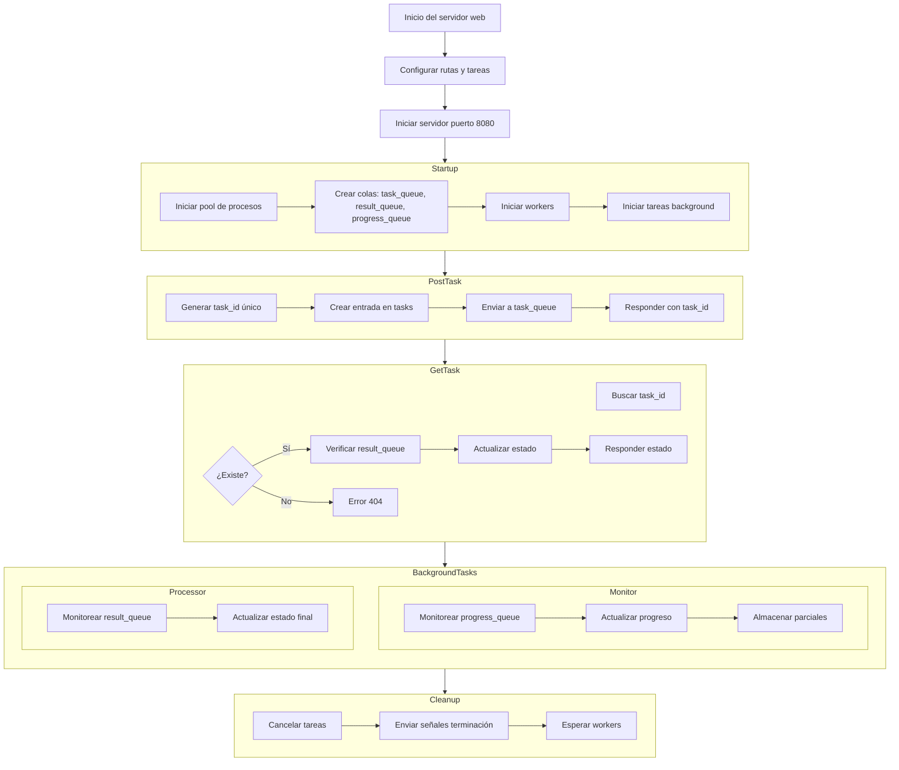
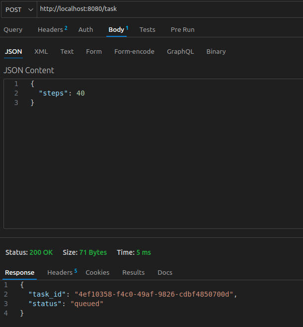
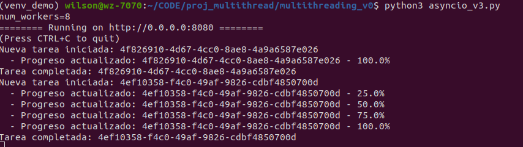

El archivo asyncio_v3.py combina las capacidades de **asyncio** para manejar operaciones de entrada/salida (I/O) de manera eficiente con **multiprocessing** para ejecutar tareas intensivas de CPU en procesos separados. A continuación, se detalla el flujo general del programa:

---

## === Bloques principales del Diagrama de flujo ===
A. **Inicio del servidor**.

B. **Startup**:
   - Iniciar pool de procesos.
   - Iniciar tareas en segundo plano.

C. **Rutas**:
   - POST `/task`: Iniciar tarea.
   - GET `/task/{task_id}`: Consultar estado.

D. **Tareas en segundo plano**:
   - Monitoreo de progreso.
   - Procesamiento de resultados.

E. **Cleanup**:
   - Detener tareas y workers.

---
## ===== Explicacion detallada ======

### **A. Inicio**
1. **Inicio del servidor web**:
   - `create_app` configura la aplicación web con rutas y tareas de inicio/limpieza.
   - `web.run_app` inicia el servidor en el puerto 8080.

---

### **B. Startup (Inicio de la aplicación)**
2. **Configuración inicial (`startup`)**:
   - Se inicia el pool de procesos (`start_process_pool`):
     - Crea colas: `task_queue`, `result_queue`, `progress_queue`.
     - Inicia procesos workers.
   - Se inicializan las tareas en segundo plano:
     - `monitor_progress`: Monitorea el progreso de las tareas.
     - `background_result_processor`: Procesa resultados finales.

---

### **C. Rutas - Flujo de solicitudes**
3. **POST `/task` (Iniciar tarea)**:
   - Genera un `task_id` único.
   - Crea una entrada en `app['tasks']` con el estado inicial de la tarea.
   - Envía la tarea a `task_queue`.
   - Responde con el `task_id` y el estado inicial.

4. **GET `/task/{task_id}` (Consultar estado)**:
   - Busca el `task_id` en `app['tasks']`.
   - Si hay resultados finales en `result_queue`, actualiza el estado de la tarea.
   - Responde con el estado actual de la tarea.

---

### **D. Tareas en segundo plano**
5. **`monitor_progress`**:
   - Monitorea `progress_queue` para actualizaciones de progreso.
   - Actualiza el progreso en `app['tasks']`.
   - Almacena resultados parciales.

6. **`background_result_processor`**:
   - Monitorea `result_queue` para resultados finales.
   - Actualiza el estado final de la tarea en `app['tasks']`.

---

### **E. Cleanup (Cierre de la aplicación)**
7. **Limpieza (`cleanup`)**:
   - Cancela las tareas en segundo plano.
   - Envía señales de terminación (`None`) a los workers.
   - Espera a que los workers terminen.

---

# ========= DETALLE ============

## **Flujo general**
El archivo asyncio_v3.py combina `asyncio` y `multiprocessing` para manejar tareas intensivas de CPU y solicitudes asíncronas. A continuación, se detalla el flujo del programa y las funciones principales:

---

### **1. Tareas CPU-bound**
Estas tareas se ejecutan en procesos separados para aprovechar múltiples núcleos de CPU.

- **`cpu_intensive_task(task_data)`**:
  - Simula una tarea intensiva de CPU.
  - Reporta el progreso a través de la cola `progress_queue`.
  - Devuelve un resultado final con el estado de la tarea.

- **`process_worker(task_queue, result_queue, progress_queue)`**:
  - Funciona como un worker que procesa tareas de la cola `task_queue`.
  - Envía resultados finales a `result_queue` y actualizaciones de progreso a `progress_queue`.
  - Finaliza cuando recibe un `None` en `task_queue`.

---

### **2. Pool de procesos**
El pool de procesos se configura al inicio de la aplicación.

- **`start_process_pool(num_workers)`**:
  - Crea colas de comunicación: `task_queue`, `result_queue`, `progress_queue`.
  - Inicia un número configurable de procesos workers.

---

### **3. Tareas en segundo plano**
Estas corutinas monitorean las colas para actualizar el estado de las tareas.

- **`monitor_progress(app)`**:
  - Monitorea `progress_queue` para recibir actualizaciones de progreso.
  - Actualiza el estado de las tareas en `app['tasks']`.

- **`background_result_processor(app)`**:
  - Monitorea `result_queue` para recibir resultados finales.
  - Actualiza el estado final de las tareas en `app['tasks']`.

---

### **4. Configuración de la aplicación**
La configuración inicial y la limpieza se manejan con eventos de inicio y cierre.

- **`startup(app)`**:
  - Inicia el pool de procesos y las colas.
  - Crea tareas en segundo plano para monitorear progreso y resultados.

- **`cleanup(app)`**:
  - Cancela las tareas en segundo plano.
  - Envía señales de terminación a los workers y espera a que finalicen.

---

### **5. Rutas del servidor web**
El servidor web basado en `aiohttp` expone dos endpoints principales:

- **`POST /task`**:
  - Inicia una nueva tarea.
  - Genera un `task_id` único y lo asocia con un estado inicial en `app['tasks']`.
  - Envía la tarea a `task_queue`.

- **`GET /task/{task_id}`**:
  - Consulta el estado de una tarea.
  - Busca el `task_id` en `app['tasks']`.
  - Verifica si hay resultados finales en `result_queue` y actualiza el estado si corresponde.

---

### **6. Ejecución principal**
- Configura el método de inicio de procesos para compatibilidad con Windows.
- Inicia el servidor web en el puerto 8080.

---

## **Flujo general**
1. El cliente envía una solicitud `POST /task` para iniciar una tarea.
2. La tarea se envía a `task_queue` y es procesada por un worker.
3. El progreso se reporta a través de `progress_queue` y es monitoreado por `monitor_progress`.
4. Los resultados finales se envían a `result_queue` y son procesados por `background_result_processor`.
5. El cliente puede consultar el estado de la tarea con `GET /task/{task_id}`.

---
# ------------ Diagrama ------------

# Corriendo ejemplo:
- Requirements: $`pip install aiohttp==3.11.18`

- Ejecutando: `(env)$ python3 asyncio_v3.py`

- Llamado **POST** usando Postman

- Resultado:

